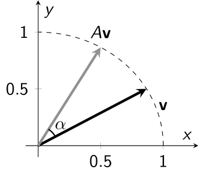

# 4: 固有値と固有ベクトル

## 4.1: 導入

行列積の性質を思い出せば, 行列 $A\in\mathbb{R}^{n\times m}$ を列ベクトルの左から掛けるという操作は, 以下の**線形性**と呼ばれる性質を満たすことがわかる:
* 任意の列ベクトル $\mathbf{v} _ 1, \mathbf{v} _ 2\in\mathbb{R}^{m\times 1}$ に対し, $A(\mathbf{v} _ 1 + \mathbf{v} _ 2) = A\mathbf{v} _ 1 + A\mathbf{v} _ 2$.
* 任意の列ベクトル $\mathbf{v}\in \mathbb{R}^{m\times 1}$ と任意のスカラー値 $\lambda$ に対し, $A(\lambda\mathbf{v}) = \lambda A\mathbf{v}$.

この性質を用いると, 正方行列 $A\in\mathbb{R}^{2\times 2}$ と列ベクトル $\mathbf{x} = \begin{pmatrix}a\cr b\end{pmatrix}$ に対し, $A\mathbf{x}$ という行列積は, 例えば以下のように計算することができる: 標準基底 
\[\mathbf{e} _ 1 = \begin{pmatrix}1\cr 0\end{pmatrix}, \qquad \mathbf{e} _ 2 = \begin{pmatrix}0\cr 1\end{pmatrix}\] に対し, $\mathbf{x} = a\mathbf{e} _ 1 + b\mathbf{e} _ 2$ であるので,
\[A\mathbf{x} = aA\mathbf{e} _ 1 + bA\mathbf{e} _ 2\] が得られる. 従って, $A\mathbf{e} _ 1$ と $A\mathbf{e} _ 2$ を計算しておけば, 一般のベクトル $\mathbf{x}$ に対して $A\mathbf{x}$ が分かることになる. 

#### <u>例</u>
\[A = \begin{pmatrix}1&2\cr 3&4\end{pmatrix},\quad \text{このとき}\quad A\begin{pmatrix}1 \cr 0\end{pmatrix} = \begin{pmatrix}1\cr 3\end{pmatrix},\quad A\begin{pmatrix}0\cr 1\end{pmatrix} = \begin{pmatrix}2\cr 4\end{pmatrix}.\]
* 従って, 例えば \[A\begin{pmatrix}3\cr 5\end{pmatrix} = 3A\begin{pmatrix}1\cr 0\end{pmatrix} + 5A\begin{pmatrix}0\cr 1\end{pmatrix} = 3\begin{pmatrix}1\cr 3\end{pmatrix} + 5\begin{pmatrix}2\cr 4\end{pmatrix} = \begin{pmatrix}13\cr 29\end{pmatrix}.\]

#### <u>注意</u>
ただし, この場合は行列積を普通に計算した方が早いし, このように計算するメリットはない. 

---

さて, 上の例では標準基底 $\mathbf{e} _ 1$, $\mathbf{e} _ 2$ に対して,  $\mathbf{x} = a\mathbf{e} _ 1 + b\mathbf{e} _ 2$ であることを用いたが, ここでは一般の列ベクトル $\mathbf{v} _ 1$, $\mathbf{v} _ 2$ を用いてみよう: 

もしも $\mathbf{x} = a\mathbf{v} _ 1 + b\mathbf{v} _ 2$ となるならば, $A\mathbf{v} _ 1$ と $A\mathbf{v} _ 2$ を計算することで
\[A\mathbf{x} = aA\mathbf{v} _ 1 + bA\mathbf{v} _ 2\] が得られる. ここで, $\mathbf{v} _ 1$ と $\mathbf{v} _ 2$ として, どのようなものを用いるのが便利だろうか. 

この問題に対する答えの一つは, $A$ を左から掛けても, 定数倍しか変わらないベクトルを用いるというものである: もしもある $\lambda _ i$ に対して
\[A\mathbf{v} _ i = \lambda _ i\mathbf{v} _ i \qquad (i=1,2)\] とできるならば, $\mathbf{x} = a\mathbf{v} _ 1 + b\mathbf{v} _ 2$ に対して
\[A\mathbf{x} = A(a\mathbf{v} _ 1 + b\mathbf{v}_ 2) = aA\mathbf{v} _ 1 + bA\mathbf{v} _ 2 = a\lambda _ 1\mathbf{v} _ 1 + b\lambda _ 2\mathbf{v} _ 2\] が得られる. このような性質を満たすベクトル $\mathbf{v} _ i$ を正方行列 $A\in\mathbb{R}^{2\times 2}$ の**固有ベクトル**, 対応する $\lambda_i$ を**固有値** という.

---

固有値及び固有ベクトルは, より一般に**線型写像**と呼ばれるものに対して定義され, 様々な応用を持つものであるが, ここでは正方行列 $A\in\mathbb{R}^{2\times 2}$ に対する固有値及び固有ベクトルのみを考えることにする:

#### <u>定義</u> (行列の固有値と固有ベクトル)
正方行列 $A\in\mathbb{R}^{2\times 2}$ に対して, 
\[A\mathbf{v} = \lambda\mathbf{v}\] を満たす, ゼロでない列ベクトル $\mathbf{v}\in \mathbb{C}^{2\times 1}$ と $\lambda\in \mathbb{C}$ のペアが存在するならば, $\mathbf{v}$ を**固有ベクトル** (**eigenvector**), $\lambda$ を**固有値** (**eigenvalue**) という. また, これらのペア $(\lambda,\mathbf{v})$ を**固有対** (**eigenpair**) と呼ぶことがある.

固有値及び固有ベクトルは, 実数でなくとも構わない点に注意. ここでは, 列ベクトル $\mathbf{v}\in\mathbb{C}^{2\times 1}$ に対し, 正方行列 $A\in\mathbb{R}^{2\times 2}$ を左から掛けるという操作の**固有値**と**固有ベクトル**の導出について具体的な計算方法を紹介し, またこれらを用いて行列の**対角化**が可能であることを述べる.

---

## 4.2: 行列による変換と固有値, 固有ベクトル

以降, 列ベクトル $\begin{pmatrix}a\cr b\end{pmatrix}\in\mathbb{R}^{2\times 1}$ を, 高校数学で学ぶベクトル (これを**幾何ベクトル**という) と同一視する. また, このベクトルを $xy$ 平面上の点 $(a,b)\in\mathbb{R}^2$ と同一視することにする. このとき, 列ベクトルの左から行列を掛けるという操作は,
* 原点 $(0,0)$ を始点とする矢印を矢印に変換する操作,
* $(x,y)$ 平面上の点を点に変換する操作

であるとみなすことができる. この同一視により, 行列によるベクトルの変換を図示することができるようになる. 以降, 列ベクトル $\mathbf{v}\in\mathbb{R}^{2\times 1}$ に対して単に $\mathbf{v}\in\mathbb{R}^2$ と表記することがある.

#### <u>例</u>
\[A = \begin{pmatrix}1&1/2\cr 1/2&1\end{pmatrix},\qquad \mathbf{v} = \begin{pmatrix}a\cr b\end{pmatrix}\in\mathbb{R}^2.\]
* $A\mathbf{v} = \begin{pmatrix}a+b/2\cr a/2+b\end{pmatrix}\in\mathbb{R}^2$.
* $\mathbf{v}$ および $A\mathbf{v}$ を幾何ベクトルや $xy$ 平面上の点と同一視すると, 行列 $A$ による変換は例えば以下の図のように解釈できる:

上の図は, ベクトル $\mathbf{v}\in\mathbb{R}^2$ を矢印で表現し, 対応する $A\mathbf{v}$ もやはり矢印で表している. 下の図は, 半径 $1$ の円周上にある $\mathbf{v}\in\mathbb{R}^2$ を丸で, 対応する $A\mathbf{v}$ を三角でプロットしたものである. 

---

次に, 固有値と固有ベクトルについて具体例を見てみる:

#### <u>例</u>
\[A = \begin{pmatrix}1&1/2\cr 1/2&1\end{pmatrix}.\]
* 例えば $\mathbf{v} _ 1 = \begin{pmatrix}1\cr -1\end{pmatrix}$ とすると, $A\mathbf{v} _ 1 = \dfrac{1}{2}\mathbf{v} _ 1$ となるため $\mathbf{v} _ 1$ は固有ベクトルであり, 対応する固有値は $1/2$ である. 
* 例えば $\mathbf{v} _ 2 = \begin{pmatrix}1\cr 1\end{pmatrix}$ とすると, $A\mathbf{v} _ 2 = \dfrac{3}{2}\mathbf{v} _ 2$ となるため $\mathbf{v} _ 2$ は固有ベクトルである, 対応する固有値は $3/2$ である.
* 例えば $\widetilde{\mathbf{v}} _ 1 = \begin{pmatrix}2i\cr -2i\end{pmatrix}$ とすると, $A\widetilde{\mathbf{v}} _ 1 = \dfrac{1}{2}\widetilde{\mathbf{v}} _ 1$ となるため $\widetilde{\mathbf{v}} _ 1$ も固有ベクトルであり, 対応する固有値は $1/2$ である. 

このように, ある列ベクトル $\mathbf{v}$ が固有ベクトルであるならば, その複素数倍もやはり固有ベクトルとなる. 

ここで, 固有ベクトルを図示するとどのようになるか見てみよう. ただし, ここでは実ベクトルであり大きさが $1$ である固有ベクトルのみを図示することにする. 上の例においては, 
\[\mathbf{v} _ 1 = \begin{pmatrix}1/\sqrt{2}\cr -1/\sqrt{2}\end{pmatrix},\qquad \mathbf{v} _ 2 = \begin{pmatrix}1/\sqrt{2}\cr 1/\sqrt{2}\end{pmatrix}\] が大きさ $1$ の固有ベクトルとなる.

上の図は例に挙げた行列 $A$ の固有ベクトル $\mathbf{v} _ 1$, $\mathbf{v} _ 2$ と, $A\mathbf{v} _ 1$ および $A\mathbf{v} _ 2$ を示したものである. このように, 行列 $A$ の固有ベクトルは $A$ による変換で向きを変えないベクトルであり, 対応する固有値 $\lambda _ 1$, $\lambda _ 2$ は固有ベクトルに対する $A$ による変換の拡大率と解釈することができる. 

ただし, 行列 $A$ が実行列であったとしても, 固有値 (と固有ベクトル) が実数であるとは限らない.

#### <u>例</u>
\[A = \begin{pmatrix}\cos\alpha & -\sin\alpha\cr \sin\alpha & \cos\alpha\end{pmatrix}.\]
* いま, ベクトル $\mathbf{v} = \begin{pmatrix}a \cr b\end{pmatrix}$ の極座標表示が \[\mathbf{v} = \begin{pmatrix}r\cos\theta\cr r\sin\theta\end{pmatrix}\] と与えられていたとする. このとき, 三角関数の加法定理より
\[A\mathbf{v} = \begin{pmatrix}\cos\alpha & -\sin\alpha\cr \sin\alpha & \cos\alpha\end{pmatrix}\begin{pmatrix}r\cos\theta\cr r\sin\theta\end{pmatrix} = \begin{pmatrix}r(\cos\theta\cos\alpha-\sin\theta\sin\alpha)\cr r(\sin\theta\cos\alpha + \cos\theta\sin\alpha)\end{pmatrix} = \begin{pmatrix}r\cos(\theta+\alpha)\cr r\sin(\theta+\alpha)\end{pmatrix}\] が得られる. つまり, この行列 $A$ はベクトル $\mathbf{v}$ を $\alpha$ だけ回転させる変換を表している.
* このような行列 $A$ を**回転行列**と呼ぶ. 
* いま, $\alpha\neq n\pi$ とする. このとき, 行列 $A$ は実数の固有値を持たない (ベクトル $\mathbf{v}$ は行列 $A$ により回転してしまうため, $\mathbf{v}$ と $A\mathbf{v}$ の向きが異なってしまう). 

 

---

## 4.3: 特性多項式を用いた行列固有値の計算

ここでは, 行列の (複素数も含む) 固有値および固有ベクトルを計算する方法を紹介する. 先ほどの例では, 行列 $A = \begin{pmatrix}1&1/2\cr 1/2&1\end{pmatrix}$ の固有値が $\lambda _ 1 = 1/2$, $\lambda _ 2 = 3/2$ であり, 対応する固有ベクトルは例えば $\mathbf{v} _ 1 = \begin{pmatrix}1\cr -1\end{pmatrix}$, $\mathbf{v} _ 2 = \begin{pmatrix}1\cr 1\end{pmatrix}$ であったが, これらをどのようにして導出するか具体的な手順を述べる.

まず, 正方行列 $A$ の固有値 $\lambda$ と固有ベクトル $\mathbf{v}$ は, 定義より
\[A\mathbf{v} = \lambda \mathbf{v}\] を満たすのであった. ここで, 右辺は単位行列 $I$ を用いて $\lambda I \mathbf{v}$ と一致するので, $A$ の固有値 $\lambda$ と固有ベクトル $\mathbf{v}$ に対して
\[(\lambda I-A)\mathbf{v}=\mathbf{0}\] が成立する. いま, 固有ベクトル $\mathbf{v}$ はゼロでないもののみ考えているため, そのような $\mathbf{v}$ が存在するためには $\det(\lambda I-A)=\mathbf{0}$ でなければならない. 実際, もしも $\det(\lambda I-A)\neq0$ であるならば, $\lambda I-A$ の逆行列が存在するため, これを両辺に左から掛けることで
\[\mathbf{v} = (\lambda I-A)^{-1}(\lambda I-A)\mathbf{v} = (\lambda I-A)^{-1}\mathbf{0} = \mathbf{0}\] となってしまう. 一方で, $\lambda I-A$ が正則でない場合には, 連立 $1$ 次方程式 \[(\lambda I-A)\mathbf{v} = 0\] の右辺が $\mathbf{0}$ であることから, (解 $\mathbf{v}$ は必ず存在し) ある条件を満たす全ての $\mathbf{v}$ が解となる.
これらより,
\[\det(\lambda I-A)=0 \iff \text{$\lambda$ は固有値であり, 対応する固有ベクトル } \mathbf{v} \text{ が存在する}\] が得られる. ここで, $A\in\mathbb{R}^{2\times 2}$ の場合は,
\[\det(\lambda I-A) = \det\begin{pmatrix}\lambda - a _ {11} & -a _ {12}\cr -a _ {21}&\lambda-a _ {22}\end{pmatrix} = (\lambda-a _ {11})(\lambda - a _ {22}) - a _ {12} a _ {21}\] となるため, \[\det(\lambda I-A) = 0\] は $\lambda$ についての $2$ 次方程式となり, 複素数の解や重解を許せば必ず解が $2$ つ存在する. これらの解が行列 $A$ の固有値となる. 固有値 $\lambda$ が得られたならば, あとは
\[(\lambda I-A)\mathbf{v} = 0\] を満たすような $\mathbf{v}$ を (必要なら掃き出し方を用いて) 見つければ, それの複素数倍は全て対応する固有ベクトルとなる.

#### <u>注意</u>
正方行列 $A$ に対して, $\det(\lambda I-A)$ のことを**特性多項式** (**characteristic polynomial**) という. 方程式 $\det(\lambda I-A)= 0$ のことは**固有方程式**と呼ぶことがある.

#### <u>注意</u>
斉次方程式 $(\lambda I-A)\mathbf{v}=\mathbf{0}$ について, $A\in\mathbb{R}^2$ のときに限って解がどのようになるか考えてみよう. いま $\det(\lambda I-A)\neq0$ ならば $\mathbf{v} = \mathbf{0}$ となることは既に述べた. もしも $\det(\lambda I-A)=0$ ならば, 
\[\lambda I-A = \begin{pmatrix}a & b\cr c & d\end{pmatrix},\qquad \mathbf{v} = \begin{pmatrix}x\cr y\end{pmatrix}\] とおくと, $\det(\lambda I-A) = ad-bc=0$ と
\[\left\lbrace\begin{array}{rll}
ax + by & = 0 & (1),\cr
cx + dy &= 0 & (2) 
\end{array}\right.\] が得られるが, $(1)$ 式を $d$ 倍し, $(2)$ 式を $b$ 倍すると,
\[\left\lbrace\begin{array}{rll}
adx + bdy & = 0 & (1)^\prime,\cr
bcx + bdy &= 0 & (2)^\prime 
\end{array}\right.\] となり, $ad-bc=0$ よりこれらは一致してしまう. つまり, これら $2$ つの式はどちらも \[ax+by=0\] を表していることになり, これを満たす $\mathbf{v} = \begin{pmatrix}x\cr y\end{pmatrix}$ は全て解である. これは, $a=b=0$ であれば, 全ての $\mathbf{v}$ が固有ベクトルになることを意味している. 一方で, もしも $a$, $b$ の少なくとも一方が $0$ でなければ, $ax+by=0$ により表される向きを持つ幾何ベクトルは, その大きさに依らず固有値となり, かつ固有値 $\lambda$ に対応する固有ベクトルはそのようなものしか存在しないことを意味している.
ここでの計算は, もちろん拡大行列に対するガウスの消去法でも構わない.

---

固有値と固有ベクトルを求める計算の具体例をいくつか挙げる. まず, $2$ つの実数の固有値が得られる場合を見てみる.

#### <u>例</u>
\[A = \begin{pmatrix}1&1/2\cr 1/2&1\end{pmatrix}.\]
* 特性多項式は $\det(\lambda I-A) = \lambda^2 - 2\lambda + 3/4 = (\lambda-1/2)(\lambda-3/2)$.
* 従って \[\det(\lambda I-A)=0\iff \lambda = 1/2,\ 3/2\] となり, $\lambda _ 1 = 1/2$ と $\lambda _ 2 = 3/2$ が行列 $A$ の固有値となる.
* $(\lambda _ 1I-A)\mathbf{v} _ 1 = \begin{pmatrix}-1/2 & -1/2\cr -1/2&-1/2\end{pmatrix}\mathbf{v} _ 1= \mathbf{0}$ を満たす $\mathbf{v} _ 1$ は $\mathbf{v} _ 1 = c _ 1 \begin{pmatrix}1\cr -1\end{pmatrix}$ となるので, これが対応する固有ベクトルとなる ( $c _ 1\neq0$ は任意).
* 同様に, $(\lambda _ 2I-A)\mathbf{v} _ 2 = \begin{pmatrix}1/2 & -1/2\cr -1/2&1/2\end{pmatrix}\mathbf{v} _ 2= \mathbf{0}$ を満たす $\mathbf{v} _ 2$ は $\mathbf{v} _ 2 = c _ 2\begin{pmatrix}1\cr 1\end{pmatrix}$ となるので, これが対応する固有ベクトルとなる ( $c _ 2\neq0$ は任意).

---

次に, 固有値が実数にならない例も見てみる:

#### <u>例</u>
\[A = \begin{pmatrix}\cos\alpha & -\sin\alpha\cr \sin\alpha & \cos\alpha\end{pmatrix} \qquad (\alpha\neq n\pi).\]
* 特性多項式は $\det(\lambda I-A) = \lambda^2 - 2\lambda\cos\alpha + 1$.
* 従って ($2$ 次方程式の解の公式を用いて) \[\det(\lambda I-A)=0\iff \lambda = \cos\alpha \pm \sqrt{\cos^2\alpha - 1} = \cos\alpha \pm i \sin\alpha\] となり, $\lambda _ 1 = \cos\alpha+i\sin\alpha$ と $\lambda _ 2 = \cos\alpha-i\sin\alpha$ が行列 $A$ の固有値となる, ただし $i=\sqrt{-1}$ は虚数単位.
* $(\lambda _ 1I-A)\mathbf{v} _ 1 = \begin{pmatrix}i\sin\alpha & \sin\alpha\cr -\sin\alpha & i\sin\alpha\end{pmatrix}\mathbf{v} _ 1= \mathbf{0}$ を満たす $\mathbf{v} _ 1$ は $\mathbf{v} _ 1 = c _ 1\begin{pmatrix}1\cr -i\end{pmatrix}$ となるので, これが対応する固有ベクトルとなる ( $c _ 1\neq0$ は任意).
* 同様に, $(\lambda _ 2I-A)\mathbf{v} _ 2 = \begin{pmatrix}-i\sin\alpha & \sin\alpha\cr -\sin\alpha & -i\sin\alpha\end{pmatrix}\mathbf{v} _ 2= \mathbf{0}$ を満たす $\mathbf{v} _ 2$ は $\mathbf{v} _ 2 = c _ 2\begin{pmatrix}1\cr i\end{pmatrix}$ となるので, これが対応する固有ベクトルとなる ( $c _ 2\neq0$ は任意).

---

最後に, 固有方程式 $\det(\lambda I-A) = 0$ が重解を持つ場合も見てみよう.

#### <u>例</u>
\[A = \begin{pmatrix}1&1\cr 0&1\end{pmatrix}.\]
* 特性多項式は $\det(\lambda I-A) = (\lambda-1)^2$.
* 従って \[\det(\lambda I-A)=0\iff \lambda = 1\] となり, 固有値は $\lambda _ 1= 1$ のみ.
* $(\lambda _ 1I-A)\mathbf{v} _ 1 = \begin{pmatrix}0& -1\cr 0 & 0\end{pmatrix}\mathbf{v} _ 1= \mathbf{0}$ を満たす $\mathbf{v} _ 1$ は $\mathbf{v} _ 1 = c _ 1 \begin{pmatrix}1\cr 0\end{pmatrix}$ となるので, これが対応する固有ベクトルとなる ( $c _ 1\neq0$ は任意).

---

## 4.4: 対角化

まず, 行列の相似について述べる:
#### <u>定義</u> (行列の相似)
$2$ つの $n$ 次正方行列 $A$, $B$ に対して, ある正則行列 $P$ が存在して,
\[B = P^{-1}AP\] となるとき, $A$ と $B$ は**相似** (**similar**) であるという.

ここで, 相似な $2$ つの行列 $A$ と $P^{-1}AP$ の関係を調べてみる. 行列式の重要な性質として, $2$ つの正方行列 $A$, $B$ に対して
\[\det (AB) = (\det A)(\det B)\] が成立する, というものがあった. この性質を用いると,
\[\begin{array}{rl}\det(\lambda I - P^{-1}AP) &= \det(\lambda P^{-1}IP - P^{-1}AP) \cr
&= \det(P^{-1}(\lambda I-A)P) \cr
& = (\det P^{-1})(\det(\lambda I-A))(\det P)\cr
&= (\det P^{-1})(\det P)(\det(\lambda I-A))\cr
&= \det(P^{-1}P)(\det(\lambda I-A))\cr
&= (\det I)(\det(\lambda I-A))\cr
&= \det(\lambda I-A)
\end{array}\] という等式が得られる. つまり, 任意の正則行列 $P$ に対し, 正方行列 $A$ と $P^{-1}AP$ の特性多項式は等しいことがわかる. そして特性多項式が等しいので固有値も等しいということになる (ただし対応する固有ベクトルが等しいとは限らない).

さらに, 先ほどと同様に計算することで,
\[\det(P^{-1}AP) = (\det P^{-1})(\det P)(\det A) = \det A\] であることもわかる. つまり, 相似な $2$ つの行列は, 行列式も固有値も等しいということがわかる. 

---

#### <u>定義</u> (対角化)
$n$ 次正方行列 $A$ が, 対角行列と相似であるならば $A$ は**対角化可能** (**diagonalizable**) という. 正方行列 $A$ が対角行列と相似である場合に, その対角行列を求める操作を行列の**対角化** (**diagonalization**) という. 

#### <u>注意</u>
対角化の際には, $A$ と相似な行列を求めるために, ある正則行列 $P$ を用いて左から $P^{-1}$, 右から $P$ を掛けることで
\[P^{-1}AP\] を計算する. 一方で, 行列の階数を求める際の基本変形は, 基本行列たちの積 $P$, $Q$ を用いて
\[F(r) = PAQ\] と表していたが, これとは異なる操作であることに注意.

まず, 対角化を計算するための具体的な計算手順を紹介する. あらかじめ触れておくと, 以下の操作は正方行列 $A\in\mathbb{R}^{2\times 2}$ の固有方程式が重解を持たない場合のみ可能である. つまり行列 $A\in\mathbb{R}^{2\times 2}$ に対して, 異なる $2$ つの固有値が得られる場合のみ考えることになる.

まず, 行列 $A\in\mathbb{R}^{2\times 2}$ の異なる $2$ つの固有値 $\lambda _ 1$, $\lambda _ 2$ に対し, 対応する固有ベクトルを $\mathbf{v} _ 1$, $\mathbf{v} _ 2$ とする (固有ベクトルの大きさは問わない). このとき, 列ベクトル $\mathbf{v} _ 1$, $\mathbf{v} _ 2\in\mathbb{R}^{2\times 1}$ を横に並べることで
\[P = \begin{pmatrix}\mathbf{v} _ 1&\mathbf{v} _ 2\end{pmatrix}\in\mathbb{R}^{2\times 2}\] とする (行列の区分けによる表記を用いている). この行列 $P$ を, 行列 $A$ の右から掛けると, $P$ の各列が固有ベクトルであることから,
\[AP = A\begin{pmatrix}\mathbf{v} _ 1&\mathbf{v} _ 2\end{pmatrix} = \begin{pmatrix}A\mathbf{v} _ 1&A\mathbf{v} _ 2\end{pmatrix} = \begin{pmatrix}\lambda _ 1\mathbf{v} _ 1&\lambda _ 2\mathbf{v} _ 2\end{pmatrix} = \begin{pmatrix}\mathbf{v} _ 1&\mathbf{v} _ 2\end{pmatrix}\begin{pmatrix}\lambda _ 1&0\cr 0&\lambda _ 2\end{pmatrix}\] となる, ただし, ここでも行列の区分けによる表記を用いている. 一番右に, 行列 $P$ が再び現れているため, 
\[AP = P\begin{pmatrix}\lambda _ 1&0\cr 0&\lambda _ 2\end{pmatrix}\] が得られる. ここで, 両辺の左から $P^{-1}$ を掛けると, 
\[P^{-1}AP = \begin{pmatrix}\lambda _ 1&0\cr 0&\lambda _ 2\end{pmatrix}\] となり, 対角成分に固有値を持つような対角行列に変形することができる. この操作を行列の**対角化**という.

この結果を, 定理として参照できるようにしておく.
#### <u>定理</u> ($2$ 次正方行列の対角化)
行列 $A\in\mathbb{R}^{2\times 2}$ が異なる $2$ つの固有値 $\lambda _ 1$, $\lambda _ 2$ を持つとき, 対応する固有ベクトルを横に並べた行列 $P = \begin{pmatrix}\mathbf{v} _ 1&\mathbf {v} _ 2\end{pmatrix}$ を用いて
\[P^{-1}AP = P^{-1}P\begin{pmatrix}\lambda _ 1&0\cr 0&\lambda _ 2\end{pmatrix} = \begin{pmatrix}\lambda _ 1&0\cr 0&\lambda _ 2\end{pmatrix}\] と対角化できる.

#### <u>注意</u>
相似な $2$ つの行列の行列式は等しいので, 上の場合は $\det A = \lambda _ 1\lambda _ 2$ となることがわかる. 実は, 行列の行列式は固有値たちの積に等しくなる (固有方程式が重解を持つ場合は, 固有値 $\lambda$ の $2$ 乗に等しくなる).

#### <u>注意</u>

相似な $2$ つの行列の行列式は等しいので, 上の場合は $\det A = \lambda _ 1\lambda _ 2$ となることがわかる. 実は, 行列の行列式は固有値たちの積に等しくなる (固有方程式が重解を持つ場合は, 固有値 $\lambda$ の $2$ 乗に等しくなる).

<fieldset style="border: 3px solid #333333; font-size: 100%; padding: 5px 15px; background-color: #eeeeee;">
    <legend>
        
            注意
        
    </legend>
    相似な $2$ つの行列の行列式は等しいので, 上の場合は $\det A = \lambda _ 1\lambda _ 2$ となることがわかる. 実は, 行列の行列式は固有値たちの積に等しくなる (固有方程式が重解を持つ場合は, 固有値 $\lambda$ の $2$ 乗に等しくなる).
</fieldset>

#### <u>注意</u>
この場合に固有ベクトルを並べた行列 $P$ が正則であることは, 以下のように確かめられる: 異なる $2$ つの固有値 $\lambda _ 1\neq \lambda _ 2$ に対する固有ベクトルを
\[\mathbf{v} _ 1 = \begin{pmatrix}a\cr b\end{pmatrix},\qquad \mathbf{v} _ 2 = \begin{pmatrix} c\cr d\end{pmatrix}\] とおく. $\lambda _ 1$ と $\lambda _ 2$ の少なくとも一方は $0$ ではないため, $\lambda _ 1\neq0$ とする. また, 固有ベクトルは $\mathbf{0}$ ではないため, $c$ と $d$ のうち少なくとも一方は $0$ でないことにも注意しておく. $P=\begin{pmatrix}a & c\cr b&d\end{pmatrix}$ となるため, $\det P = ad-bc$ である. ここで, もしも $\det P = 0$ であるならば, 
\[a\mathbf{v} _ 2 = \begin{pmatrix}ac\cr ad\end{pmatrix} = \begin{pmatrix}ac\cr bc\end{pmatrix} = c\mathbf{v} _ 1,\qquad b\mathbf{v} _ 2 = d\mathbf{v} _ 1\] となるため, 
\[\left\lbrace\begin{array}{rl}&c\lambda _ 1\mathbf{v} _ 1 = A(c\mathbf{v} _ 1) = A(a\mathbf{v} _ 2) = a\lambda _ 2\mathbf{v} _ 2 = c\lambda _ 2\mathbf{v} _ 1 \cr
&d\lambda _ 1\mathbf{v} _ 1 = A(d\mathbf{v} _ 1) = A(b\mathbf{v} _ 2) = b\lambda _ 2\mathbf{v} _ 2 = d\lambda _ 2\mathbf{v} _ 1 \end{array}\right.\] となるが, $c$ と $d$ の少なくとも一方は $0$ でないため, これは $\lambda _ 1\neq \lambda _ 2$ に矛盾する. 従って, 背理法より $\det P \neq 0$ である.

#### <u>注意</u>
一般に, $A$ が $n$ 次正方行列あった場合には, $P$ が正則行列か確認することはさらに複雑になるが, 実は以下の性質が成り立つ:
\[A \text{ の固有値が全て異なる} \implies A \text{ の固有ベクトルを並べた行列 $P$ は正則} \] 固有方程式が重解を持つような行列であっても (つまり行列 $A$ が重複する固有値を持つ場合であっても), $P$ が正則となり対角化可能な場合は存在する. ただし,  $A$ が $2$ 次正方行列の場合は, そのような行列 $A$ は $A = \lambda I$ に限られる. ここではこのような状況には興味がないため, $A\in\mathbb{R}^{2\times 2}$ が異なる $2$ つの固有値を持つ場合のみを考えることにする.

#### <u>例</u>
\[A = \begin{pmatrix}1&1/2\cr 1/2&1\end{pmatrix}.\]
* 固有値は $\lambda _ 1 = 1/2$ と $\lambda _ 2 = 3/2$ であり, 対応する固有ベクトルは, 例えば \[\mathbf{v} _ 1 = \begin{pmatrix}1\cr -1\end{pmatrix},\qquad \mathbf{v} _ 2 = \begin{pmatrix}1\cr 1\end{pmatrix}\] であった. 
* これを用いて, \[P = \begin{pmatrix}\mathbf{v} _ 1&\mathbf{v} _ 2\end{pmatrix} = \begin{pmatrix}1&1\cr -1&1\end{pmatrix}\] とすると, \[AP = P\begin{pmatrix}\lambda _ 1&0\cr 0&\lambda _ 2\end{pmatrix},\qquad P^{-1}AP = \begin{pmatrix}\lambda _ 1&0\cr 0&\lambda _ 2\end{pmatrix}\] が得られる. 実際, $P^{-1} = \begin{pmatrix}1/2&-1/2\cr 1/2&1/2\end{pmatrix}$ であり,
\[P^{-1}AP = P^{-1}\begin{pmatrix}1/2&3/2\cr -1/2&3/2\end{pmatrix} = P^{-1}\begin{pmatrix}1&1\cr -1&1\end{pmatrix}\begin{pmatrix}1/2&0\cr 0&3/2\end{pmatrix} = \begin{pmatrix}1/2&0\cr 0&3/2\end{pmatrix}\] であることを確かめられる.
* 対角化が固有ベクトルの大きさに依存しない (固有ベクトルの向きにのみ依存する) ことを確かめてみる. 例えば, 対応する固有ベクトルを
\[\mathbf{v} _ 1 = \begin{pmatrix}2\cr -2\end{pmatrix},\qquad \mathbf{v} _ 2 = \begin{pmatrix}1/2\cr 1/2\end{pmatrix}\] としたときには,
\[P = \begin{pmatrix}2&1/2\cr -2&1/2\end{pmatrix},\qquad P^{-1}=\begin{pmatrix}1/4&-1/4\cr 1&1\end{pmatrix}\] となり, 
\[P^{-1}AP = P^{-1}\begin{pmatrix}1&3/4\cr -1&3/4\end{pmatrix} = P^{-1}\begin{pmatrix}2&1/2\cr -2&1/2\end{pmatrix}\begin{pmatrix}1/2&0\cr 0&3/2\end{pmatrix} = \begin{pmatrix}1/2 & 0\cr 0&3/2\end{pmatrix}\] が得られる.

---

対角化の典型的な応用例として, 対角化可能行列 $A$ に対して $A^k$ を計算してみる. まず, 対角行列 $\begin{pmatrix}\lambda _ 1&0\cr 0&\lambda _ 2\end{pmatrix}$ に対し,
\[\begin{pmatrix}\lambda _ 1&0\cr 0&\lambda _ 2\end{pmatrix}^k = \begin{pmatrix}\lambda _ 1^k&0\cr 0&\lambda _ 2^k\end{pmatrix}\] が成立する. 従って, $P^{-1}AP = \begin{pmatrix}\lambda _ 1&0\cr 0&\lambda _ 2\end{pmatrix}$ と対角化が可能な行列 $A$ に対して,
\[\begin{array}{rl}A^k &= P(P^{-1}AP)(P^{-1}AP) \dots (P^{-1}AP)P^{-1}\cr
&= P\begin{pmatrix}\lambda _ 1&0\cr 0&\lambda _ 2\end{pmatrix}^k P^{-1}\cr
&= P\begin{pmatrix}\lambda _ 1^k&0\cr 0&\lambda _ 2^k\end{pmatrix}P^{-1}
\end{array}\] と計算することができる. 

#### <u>例</u>
\[A = \begin{pmatrix}1&1/2\cr 1/2&1\end{pmatrix}, \qquad \mathbf{v} = \begin{pmatrix}a\cr b\end{pmatrix}.\]
行列 $A$ の固有値は $\lambda _ 1 = 1/2$ と $\lambda _ 2 = 3/2$ であり, 対応する固有ベクトルは, 例えば \[\mathbf{v} _ 1 = \begin{pmatrix}1\cr -1\end{pmatrix},\qquad \mathbf{v} _ 2 = \begin{pmatrix}1\cr 1\end{pmatrix}\] であった. いま, $A^k\mathbf{v}$ を $2$ 通りの方法で計算してみよう.
* まず, $\mathbf{v} = \dfrac{a-b}{2}\mathbf{v} _ 1 + \dfrac{a+b}{2}\mathbf{v} _ 2$ であることに注目して計算してみる. \[\begin{array}{rl}A^k\mathbf{v} &= \dfrac{a-b}{2}A^k\mathbf{v} _ 1 + \dfrac{a+b}{2}A^k\mathbf{v} _ 2\cr
&= \dfrac{a-b}{2}\lambda _ 1^k\mathbf{v} _ 1 + \dfrac{a+b}{2}\lambda _ 2^k\mathbf{v} _ 2\cr
&= \dfrac{1}{2}\begin{pmatrix}\lambda _ 1^k(a-b)+\lambda _ 2^k(a+b)\cr -\lambda _ 1^k(a-b) + \lambda _ 2^k(a+b)\end{pmatrix}.
\end{array}\]
* 次に, 行列 $A$ の対角化を用いて計算してみる. 
\[P = \begin{pmatrix}1&1\cr -1&1\end{pmatrix},\qquad P^{-1} = \begin{pmatrix}1/2 & -1/2\cr 1/2&1/2\end{pmatrix}\] を用いて,
\[A^k = P\begin{pmatrix}\lambda _ 1^k&0\cr 0&\lambda _ 2^k\end{pmatrix}P^{-1} = \dfrac{1}{2}\begin{pmatrix}\lambda _ 1^k+\lambda _ 2^k & -\lambda _ 1^k+\lambda _ 2^k\cr -\lambda _ 1^k+\lambda _ 2^k& \lambda _ 1^k+\lambda _ 2^k\end{pmatrix}\] が得られるため,
\[A^k\mathbf{v} = \dfrac{1}{2}\begin{pmatrix}a(\lambda _ 1^k+\lambda _ 2^k) + b(-\lambda _ 1^k+\lambda _ 2^k)\cr a(-\lambda _ 1^k+\lambda _ 2^k) + b(\lambda _ 1^k+\lambda _ 2^k)\end{pmatrix}.\]
* どちらも同じ結果が得られる.

---

#### <u>まとめ</u>
* $A\in\mathbb{R}^{2\times 2}$ の場合に限定して, 固有値と固有ベクトルの定義を述べ, 具体的に計算する手順を紹介した.
* 行列 $A$ の固有値が全て異なる場合に, 対応する固有ベクトルを横に並べた行列 $P$ を用いて $P^{-1}AP$ を計算することで対角化が可能であることを示した. 
