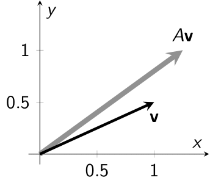
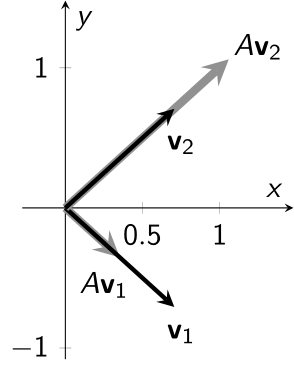

# 4: 固有値と固有ベクトル

## 4.1: 導入

行列積の性質を思い出せば, 行列 $A\in\mathbb{R}^{n\times m}$ を列ベクトルの左から掛けるという操作は, 以下の**線形性**と呼ばれる性質を満たすことがわかる:
* 任意の列ベクトル $\mathbf{v} _ 1, \mathbf{v} _ 2\in\mathbb{R}^{m\times 1}$ に対し, $A(\mathbf{v} _ 1 + \mathbf{v} _ 2) = A\mathbf{v} _ 1 + A\mathbf{v} _ 2$.
* 任意の列ベクトル $\mathbf{v}\in \mathbb{R}^{m\times 1}$ と任意のスカラー値 $\lambda$ に対し, $A(\lambda\mathbf{v}) = \lambda A\mathbf{v}$.

この性質を用いると, 正方行列 $A\in\mathbb{R}^{2\times 2}$ と列ベクトル $\mathbf{x} = \begin{pmatrix}a\cr b\end{pmatrix}$ に対し, $A\mathbf{x}$ という行列積は, 例えば以下のように計算することができる: 標準基底 
\[\mathbf{e} _ 1 = \begin{pmatrix}1\cr 0\end{pmatrix}, \qquad \mathbf{e} _ 2 = \begin{pmatrix}0\cr 1\end{pmatrix}\] に対し, $\mathbf{x} = a\mathbf{e} _ 1 + b\mathbf{e} _ 2$ であるので,
\[A\mathbf{x} = aA\mathbf{e} _ 1 + bA\mathbf{e} _ 2\] が得られる. 従って, $A\mathbf{e} _ 1$ と $A\mathbf{e} _ 2$ を計算しておけば, 一般のベクトル $\mathbf{x}$ に対して $A\mathbf{x}$ が分かることになる. 

#### <u>例</u>
\[A = \begin{pmatrix}1&2\cr 3&4\end{pmatrix},\quad \text{このとき}\quad A\begin{pmatrix}1 \cr 0\end{pmatrix} = \begin{pmatrix}1\cr 3\end{pmatrix},\quad A\begin{pmatrix}0\cr 1\end{pmatrix} = \begin{pmatrix}2\cr 4\end{pmatrix}.\]
* 従って, 例えば \[A\begin{pmatrix}3\cr 5\end{pmatrix} = 3A\begin{pmatrix}1\cr 0\end{pmatrix} + 5A\begin{pmatrix}0\cr 1\end{pmatrix} = 3\begin{pmatrix}1\cr 3\end{pmatrix} + 5\begin{pmatrix}2\cr 4\end{pmatrix} = \begin{pmatrix}13\cr 29\end{pmatrix}.\]

#### <u>注意</u>
ただし, この場合は行列積を普通に計算した方が早いし, このように計算するメリットはない. 

---

さて, 上の例では標準基底 $\mathbf{e} _ 1$, $\mathbf{e} _ 2$ に対して,  $\mathbf{x} = a\mathbf{e} _ 1 + b\mathbf{e} _ 2$ であることを用いたが, ここでは一般の列ベクトル $\mathbf{v} _ 1$, $\mathbf{v} _ 2$ を用いてみよう: 

もしも $\mathbf{x} = a\mathbf{v} _ 1 + b\mathbf{v} _ 2$ となるならば, $A\mathbf{v} _ 1$ と $A\mathbf{v} _ 2$ を計算することで
\[A\mathbf{x} = aA\mathbf{v} _ 1 + bA\mathbf{v} _ 2\] が得られる. ここで, $\mathbf{v} _ 1$ と $\mathbf{v} _ 2$ として, どのようなものを用いるのが便利だろうか. 

この問題に対する答えの一つは, $A$ を左から掛けても, 定数倍しか変わらないベクトルを用いるというものである: もしもある $\lambda _ i$ に対して
\[A\mathbf{v} _ i = \lambda _ i\mathbf{v} _ i \qquad (i=1,2)\] とできるならば, $\mathbf{x} = a\mathbf{v} _ 1 + b\mathbf{v} _ 2$ に対して
\[A\mathbf{x} = A(a\mathbf{v} _ 1 + b\mathbf{v}_ 2) = aA\mathbf{v} _ 1 + bA\mathbf{v} _ 2 = a\lambda _ 1\mathbf{v} _ 1 + b\lambda _ 2\mathbf{v} _ 2\] が得られる. このような性質を満たすベクトル $\mathbf{v} _ i$ を正方行列 $A\in\mathbb{R}^{2\times 2}$ の**固有ベクトル**, 対応する $\lambda_i$ を**固有値** という.

---

固有値及び固有ベクトルは, より一般に**線型写像**と呼ばれるものに対して定義され, 様々な応用を持つものであるが, ここでは正方行列 $A\in\mathbb{R}^{2\times 2}$ に対する固有値及び固有ベクトルのみを考えることにする:

#### <u>定義</u> (行列の固有値と固有ベクトル)
正方行列 $A\in\mathbb{R}^{2\times 2}$ に対して, 
\[A\mathbf{v} = \lambda\mathbf{v}\] を満たす, ゼロでない列ベクトル $\mathbf{v}\in \mathbb{C}^{2\times 1}$ と $\lambda\in \mathbb{C}$ のペアが存在するならば, $\mathbf{v}$ を**固有ベクトル** (**eigenvector**), $\lambda$ を**固有値** (**eigenvalue**) という. また, これらのペア $(\lambda,\mathbf{v})$ を**固有対** (**eigenpair**) と呼ぶことがある.

固有値及び固有ベクトルは, 実数でなくとも構わない点に注意. ここでは, 列ベクトル $\mathbf{v}\in\mathbb{C}^{2\times 1}$ に対し, 正方行列 $A\in\mathbb{R}^{2\times 2}$ を左から掛けるという操作の**固有値**と**固有ベクトル**について, それが $A$ の特徴と関係していることに言及する.

---

## 4.2: 行列による変換と固有値

以降, 列ベクトル $\begin{pmatrix}a\cr b\end{pmatrix}\in\mathbb{R}^{2\times 1}$ を, 高校数学で学ぶベクトル (これを**幾何ベクトル**という) と同一視する. また, このベクトルを $xy$ 平面上の点 $(a,b)\in\mathbb{R}^2$ と同一視することにする. このとき, 列ベクトルの左から行列を掛けるという操作は,
* 原点 $(0,0)$ を始点とする矢印を矢印に変換する操作,
* $(x,y)$ 平面上の点を点に変換する操作

であるとみなすことができる. この同一視により, 行列によるベクトルの変換を図示することができるようになる. 以降, 列ベクトル $\mathbf{v}\in\mathbb{R}^{2\times 1}$ に対して単に $\mathbf{v}\in\mathbb{R}^2$ と表記することがある.

#### <u>例</u>
\[A = \begin{pmatrix}1&1/2\cr 1/2&1\end{pmatrix},\qquad \mathbf{v} = \begin{pmatrix}a\cr b\end{pmatrix}\in\mathbb{R}^2.\]
* $A\mathbf{v} = \begin{pmatrix}a+b/2\cr a/2+b\end{pmatrix}\in\mathbb{R}^2$.
* $\mathbf{v}$ および $A\mathbf{v}$ を幾何ベクトルや $xy$ 平面上の点と同一視すると, 行列 $A$ による変換は例えば以下の図のように解釈できる:

左側の図は, ベクトル $\mathbf{v}\in\mathbb{R}^2$ を矢印で表現し, 対応する $A\mathbf{v}$ もやはり矢印で表している. 右側の図は, 半径 $1$ の円周上にある $\mathbf{v}\in\mathbb{R}^2$ を丸で, 対応する $A\mathbf{v}$ を三角でプロットしたものである. 

---

次に, 固有値と固有ベクトルについて具体例を見てみる:

#### <u>例</u>
\[A = \begin{pmatrix}1&1/2\cr 1/2&1\end{pmatrix}.\]
* 例えば $\mathbf{v} _ 1 = \begin{pmatrix}1\cr -1\end{pmatrix}$ とすると, $A\mathbf{v} _ 1 = \dfrac{1}{2}\mathbf{v} _ 1$ となるため $\mathbf{v} _ 1$ は固有ベクトルであり, 対応する固有値は $1/2$ である. 
* 例えば $\mathbf{v} _ 2 = \begin{pmatrix}1\cr 1\end{pmatrix}$ とすると, $A\mathbf{v} _ 2 = \dfrac{3}{2}\mathbf{v} _ 2$ となるため $\mathbf{v} _ 2$ は固有ベクトルである, 対応する固有値は $5$ である.
* 例えば $\widetilde{\mathbf{v}} _ 1 = \begin{pmatrix}2i\cr -2i\end{pmatrix}$ とすると, $A\widetilde{\mathbf{v}} _ 1 = \dfrac{1}{2}\widetilde{\mathbf{v}} _ 1$ となるため $\widetilde{\mathbf{v}} _ 1$ も固有ベクトルであり, 対応する固有値は $-1$ である. 

このように, ある列ベクトル $\mathbf{v}$ が固有ベクトルであるならば, その複素数倍もやはり固有ベクトルとなる. 

ここで, 固有ベクトルを図示するとどのようになるか見てみよう. ただし, ここでは実ベクトルであり大きさが $1$ である固有ベクトルのみを図示することにする. 上の例においては, 
\[\mathbf{v} _ 1 = \begin{pmatrix}1/\sqrt{2}\cr -1/\sqrt{2}\end{pmatrix},\qquad \mathbf{v} _ 2 = \begin{pmatrix}1/\sqrt{2}\cr 1/\sqrt{2}\end{pmatrix}\] が大きさ $1$ の固有ベクトルとなる.

上の図は例に挙げた行列 $A$ の固有ベクトル $\mathbf{v} _ 1$, $\mathbf{v} _ 2$ と, $A\mathbf{v} _ 1$ および $A\mathbf{v} _ 2$ を示したものである. このように, 行列 $A$ の固有ベクトルは $A$ による変換で向きを変えないベクトルであり, 対応する固有値 $\lambda _ 1$, $\lambda _ 2$ は固有ベクトルに対する $A$ による変換の拡大率と解釈することができる. 

ただし, 行列 $A$ が実行列であったとしても, 固有値 (と固有ベクトル) が実数であるとは限らない.

#### <u>例</u>
\[A = \begin{pmatrix}\cos\alpha & -\sin\alpha\cr \sin\alpha & \cos\alpha\end{pmatrix}.\]
* いま, ベクトル $\mathbf{v} = \begin{pmatrix}a \cr b\end{pmatrix}$ の極座標表示が \[\mathbf{v} = \begin{pmatrix}r\cos\theta\cr r\sin\theta\end{pmatrix}\] と与えられていたとする. このとき, 三角関数の加法定理より
\[A\mathbf{v} = \begin{pmatrix}\cos\alpha & -\sin\alpha\cr \sin\alpha & \cos\alpha\end{pmatrix}\begin{pmatrix}r\cos\theta\cr r\sin\theta\end{pmatrix} = \begin{pmatrix}r(\cos\theta\cos\alpha-\sin\theta\sin\alpha)\cr r(\sin\theta\cos\alpha + \cos\theta\sin\alpha)\end{pmatrix} = \begin{pmatrix}r\cos(\theta+\alpha)\cr r\sin(\theta+\alpha)\end{pmatrix}\] が得られる. つまり, この行列 $A$ はベクトル $\mathbf{v}$ を $\alpha$ だけ回転させる変換を表している.
* このような行列 $A$ を**回転行列**と呼ぶ. 
* いま, $\alpha\neq n\pi$ とする. このとき, 行列 $A$ は実数の固有値を持たない (ベクトル $\mathbf{v}$ は行列 $A$ により回転してしまうため, $\mathbf{v}$ と $A\mathbf{v}$ の向きが異なってしまう). 

 

---

## 4.3: 特性多項式を用いた行列固有値の計算

ここでは, 行列の (複素数も含む) 固有値および固有ベクトルを計算する方法を紹介する. 先ほどの例では, 行列 $A = \begin{pmatrix}1&1/2\cr 1/2&1\end{pmatrix}$ の固有値が $\lambda _ 1 = 1/2$, $\lambda _ 2 = 3/2$ であり, 対応する固有ベクトルは例えば $\mathbf{v} _ 1 = \begin{pmatrix}1\cr -1\end{pmatrix}$, $\mathbf{v} _ 2 = \begin{pmatrix}1\cr 1\end{pmatrix}$ であったが, これらをどのようにして導出するか具体的な手順を述べる.

まず, 正方行列 $A$ の固有値 $\lambda$ と固有ベクトル $\mathbf{v}$ は, 定義より
\[A\mathbf{v} = \lambda \mathbf{v}\] を満たすのであった. ここで, 右辺は単位行列 $I$ を用いて $\lambda I \mathbf{v}$ と一致するので, $A$ の固有値 $\lambda$ と固有ベクトル $\mathbf{v}$ に対して
\[(\lambda I-A)\mathbf{v}=\mathbf{0}\] が成立する. いま, 固有ベクトル $\mathbf{v}$ はゼロでないもののみ考えているため, そのような $\mathbf{v}$ が存在するためには $\det(\lambda I-A)=\mathbf{0}$ でなければならない. 実際, もしも $\det(\lambda I-A)\neq0$ であるならば, $\lambda I-A$ の逆行列が存在するため, これを両辺に左から掛けることで
\[\mathbf{v} = (\lambda I-A)^{-1}(\lambda I-A)\mathbf{v} = (\lambda I-A)^{-1}\mathbf{0} = \mathbf{0}\] となってしまう. 一方で, $\lambda I-A$ が正則でない場合には, 連立 $1$ 次方程式 \[(\lambda I-A)\mathbf{v} = 0\] の右辺が $\mathbf{0}$ であることから, (解 $\mathbf{v}$ は必ず存在し) ある条件を満たす $\mathbf{v}$ 全てが解となる.
これらより,
\[\det(\lambda I-A)=0 \iff \text{固有ベクトル } \mathbf{v} \text{ が存在する}.\] が得られる. ここで, $A\in\mathbb{R}^{2\times 2}$ の場合は,
\[\det(\lambda I-A) = \det\begin{pmatrix}\lambda - a _ {11} & -a _ {12}\cr -a _ {21}&\lambda-a _ {22}\end{pmatrix} = (\lambda-a _ {11})(\lambda - a _ {22}) - a _ {12} a _ {21}\] となるため, \[\det(\lambda I-A) = 0\] は $\lambda$ についての $2$ 次方程式となり, 複素数の解や重解を許せば必ず解が $2$ つ存在する. これらの解が行列 $A$ の固有値となる. 固有値 $\lambda$ が得られたならば, あとは
\[(\lambda I-A)\mathbf{v} = 0\] を満たすような $\mathbf{v}$ を (必要なら掃き出し方やクラメルの公式を用いて) 見つければ, それが対応する固有ベクトルとなる.

#### <u>注意</u>
正方行列 $A$ に対して, $\det(\lambda I-A)$ のことを**特性多項式** (**characteristic polynomial**) という.

#### <u>例</u>
\[A = \begin{pmatrix}1&1/2\cr 1/2&1\end{pmatrix}.\]
* 特性多項式は $\det(\lambda I-A) = \lambda^2 - 2\lambda + 3/4 = (\lambda-1/2)(\lambda-3/2)$.
* 従って \[\det(\lambda I-A)=0\iff \lambda = 1/2,\ 3/2\] となり, $\lambda _ 1 = 1/2$ と $\lambda _ 2 = 3/2$ が行列 $A$ の固有値となる.
* $(\lambda _ 1I-A)\mathbf{v} _ 1 = \begin{pmatrix}-1/2 & -1/2\cr -1/2&-1/2\end{pmatrix}\mathbf{v} _ 1= \mathbf{0}$ を満たす $\mathbf{v} _ 1$ として, 例えば $\mathbf{v} _ 1 = \begin{pmatrix}1\cr -1\end{pmatrix}$ と選べば, これが対応する固有ベクトルとなる.
* 同様に, $(\lambda _ 2I-A)\mathbf{v} _ 2 = \begin{pmatrix}1/2 & -1/2\cr -1/2&1/2\end{pmatrix}\mathbf{v} _ 2= \mathbf{0}$ を満たす $\mathbf{v} _ 2$ として, 例えば $\mathbf{v} _ 2 = \begin{pmatrix}1\cr 1\end{pmatrix}$ と選べば, これが対応する固有ベクトルとなる.

次に, 固有値が実数にならない例も見てみる:

#### <u>例</u>
\[A = \begin{pmatrix}\cos\alpha & -\sin\alpha\cr \sin\alpha & \cos\alpha\end{pmatrix} \qquad (\alpha\neq n\pi).\]
* 特性多項式は $\det(\lambda I-A) = \lambda^2 - 2\lambda\cos\alpha + 1$.
* 従って ($2$ 次方程式の解の公式を用いて) \[\det(\lambda I-A)=0\iff \lambda = \cos\alpha \pm \sqrt{\cos^2\alpha - 1} = \cos\alpha \pm i \sin\alpha\] となり, $\lambda _ 1 = \cos\alpha+i\sin\alpha$ と $\lambda _ 2 = \cos\alpha-i\sin\alpha$ が行列 $A$ の固有値となる, ただし $i=\sqrt{-1}$ は虚数単位.
* $(\lambda _ 1I-A)\mathbf{v} _ 1 = \begin{pmatrix}i\sin\alpha & \sin\alpha\cr -\sin\alpha & i\sin\alpha\end{pmatrix}\mathbf{v} _ 1= \mathbf{0}$ を満たす $\mathbf{v} _ 1$ として, 例えば $\mathbf{v} _ 1 = \begin{pmatrix}1\cr -i\end{pmatrix}$ と選べば, これが対応する固有ベクトルとなる.
* 同様に, $(\lambda _ 2I-A)\mathbf{v} _ 2 = \begin{pmatrix}1/2 & -1/2\cr -1/2&1/2\end{pmatrix}\mathbf{v} _ 2= \mathbf{0}$ を満たす $\mathbf{v} _ 2$ として, 例えば $\mathbf{v} _ 2 = \begin{pmatrix}1\cr 1\end{pmatrix}$ と選べば, これが対応する固有ベクトルとなる.

---

まず, **集合**および**写像**という概念について簡単に紹介する.

#### <u>定義</u> (集合)
* ものの集まりを**集合** (**set**) といい, 集合に含まれる "もの" のことを**元** (**element**) もしくは要素という. 
* ある集合 $A$ が $a _ 1$, $a _ 2$, $\dots$, $a _ n$ という $n$ 個の元から構成される場合, 
\[A = \lbrace a _ 1, a _ 2, \dots, a _ n\rbrace\] と表記する. 
* 集合 $A$ が, ある特定の性質を満たすものを全て集めた集合であるならば,
\[A = \lbrace a \mid \text{($a$ が満たす条件)} \rbrace\] と表記する.
* $a$ が集合 $A$ の元であるなら $a\in A$ と表記し, そうでないなら $a\not\in A$ と表記する.

#### <u>例</u>
* 実数全体のことを $\mathbb{R}$ と表記する. $a$ が実数ならば $a\in \mathbb{R}$ であり, $a$ が実数でないならば (例えば $a$ が純虚数のとき) $a\not\in\mathbb{R}$ である.
* $A$ を偶数全体とすると, 例えば $A = \lbrace a\mid a\text{ は偶数}\rbrace$ などと表記できる.

#### <u>定義</u> (部分集合)
* 集合 $B$ の全ての元が, 集合 $A$ の元でもあるならば, $B$ は $A$ の**部分集合** (**subset**) であるといい, $B\subset A$ と表記する.
* 特に集合 $B$ が, 集合 $A$ の元のうち特定の性質を満たすもののみ集めたものであるとき, \[B= \lbrace a\in A\mid \text{($a$ が満たす条件)}\rbrace\] と表記する.
* $2$ つの集合 $A$, $B$ に対して, $A\subset B$ かつ $B\subset A$ であるとき, 集合 $A$ と $B$ は等しいといい, $A=B$ と表記する.

#### <u>注意</u>
$2$ つの集合 $A$, $B$ に対して, $B\subset A$ の定義は \[a\in B\implies a\in A\] という意味である.

#### <u>例</u>
* 複素数全体のことを $\mathbb{C}$ と表記する. 実数は特に複素数であるため, \[\mathbb{R}\subset \mathbb{C}\] である.
* $A$ を非負の実数全体とすると, $A$ の全ての元は特に実数であるので$A\subset\mathbb{R}$ である. また, このとき例えば \[ A=\lbrace a \in\mathbb{R} \mid a\ge 0 \rbrace\] と表記できる.
* $B = \lbrace a\in\mathbb{R}\mid a=\lvert a\rvert \rbrace$ とする, このとき, 上の集合 $A$ に対して, $A=B$ が成立する. 
    * 実際, $a\in A$ ならば $a=\lvert a\rvert|$ なので $A\subset B$ である.
    * また, $a\in B$ ならば $a=\lvert a\rvert$ を満たす実数 $a$ は非負のものに限られるので $B\subset A$ である.

また, ベクトル空間についても簡単に言及しておく. ある性質を満たす集合を**ベクトル空間**と呼ぶのだが, ここではその性質については説明はしない.
* $n$ 個の実数の組たち全体からなる集合を $\mathbb{R}^n$ と表記する.
* $n$ 個の複素数の組たち全体からなる集合を $\mathbb{C}^n$ と表記する.
* $\mathbb{R}^n$, $\mathbb{C}^n$ は**ベクトル空間** (**vector space**) もしくは**線形空間** (**linear space**) と呼ばれるものの一種である.
* ベクトル空間の元を**ベクトル**という. 
* $\mathbb{R}^n$ の元が点の位置 (座標) を指定しているとみなすとき, $\mathbb{R}^n$ を**座標空間** (**coordinate space**) という (つまり座標空間はベクトル空間の一種).
* 以降, 高校数学で学ぶベクトル (これを幾何ベクトルという) $\vec{x} = (a,b)$ や, 列ベクトル $\begin{pmatrix}a\cr b\end{pmatrix}$ を, $x$ 座標が $a$ であり $y$ 座標が $b$ である点 $(a,b)\in\mathbb{R}^2$ と同一視することにする.

---

#### <u>定義</u> (写像)
* 二つの集合 $A$, $B$ に対し, $A$の元 を $B$ の元に対応させる関係を**写像** (**mapping**) という. 
* $T$ が $A$ の元 を $B$ の元に対応させる写像であるとき, 
\[T:A\to B\] と表記する. また, $a\in A$ に対応する $B$ の元を $Ta$ もしくは $T(a)$ と表記する.
* $B$ が数からなる集合であるとき, 写像 $T$ は**関数** (**function**) という.

#### <u>定義</u> (線形写像)
$2$ つのベクトル空間 $V$, $W$ に対して, 写像 $T:V\to W$ が以下を満たすとき, $T$ を**線形写像** (**linear mapping**) もしくは**線形変換** (**linear transform**) という:
* 任意の $x$, $y\in V$ に対して $T(x+y) = Tx+Ty$.
* 任意のスカラー値 $a$ と $x\in V$ に対して $T(ax) = aTx$.

線形写像が関数ならば, それを**線形関数** (**linear function**) と呼ぶ.

---

## 4.3: 線型関数の表現行列

まず, ベクトルに『左からある行列 $A\in\mathbb{R}^{2\times 2}$ を掛ける』という操作が線形関数になっていることを確認しよう. 簡単のため, ここでは $A\in\mathbb{R}^{2\times 2}$ の場合のみを考える:
* 任意の $\mathbf{v} _ 1$, $\mathbf{v} _ 2 \in\mathbb{R}^2$ に対して $A(\mathbf{v} _ 1 + \mathbf{v} _ 2) = A\mathbf{v} _ 1 + A\mathbf{v} _ 2$.
* 任意のスカラー値 $\lambda$ と $\mathbf{v}\in\mathbb{R}^2$ に対して $A(\lambda\mathbf{v}) = \lambda A\mathbf{v}$.

これらが成立することは行列積の定義から得られる ($\mathbf{v}\in\mathbb{R}^2$ を列ベクトルと同一視していることに注意).

 次に, ベクトル $\mathbb{R}^2$ を $\mathbb{R}^2$ に移す線形写像 (線形関数) は, 『左からある行列 $A\in\mathbb{R}^{2\times 2}$ を掛ける』というものに限られることを示す.

#### <u>定理</u> (表現行列)
任意の線形関数 $T:\mathbb{R}^2\to\mathbb{R}^2$ に対して, (対応する) ある行列 $A\in\mathbb{R}^{2\times 2}$ が存在し, 任意の $\mathbf{v}\in\mathbb{R}^2$ に対し
\[T\mathbf{v} = A\mathbf{v}\] を満たす.

> 証明  
ベクトル $\mathbf{v} = (v _ 1, v _ 2)$ に対して, 例えば標準基底 \[\mathbf{e} _ 1 = (1,0),\quad \mathbf{e} _ 2 = (0,1)\] を用いて $\mathbf{v} = v _ 1\mathbf{e} _ 1 + v _ 2\mathbf{e} _ 2$ と表すことにする. ここで, $T:\mathbb{R}^2\to\mathbb{R}^2$ は線形なので, 
\[T\mathbf{v} = v _ 1T\mathbf{e} _ 1 + v _ 2T\mathbf{e} _ 2\] である. ここで, 行列 $A$ として, 第 $i$ 列ベクトルが $T\mathbf{e} _ i$ である (と同一視できる) ものを取ると, $T\mathbf{e} _ i = A\mathbf{e} _ i$ となるので, \[\begin{array}{rl}T\mathbf{v} &= v _ 1A\mathbf{e} _ 1 + v _ 2A\mathbf{e} _ 2\cr &= A(v _ 1\mathbf{e} _ 1) + A(v _ 2\mathbf{e} _ 2)\cr &= A(v _ 1\mathbf{e} _ 1 + v _ 2\mathbf{e} _ 2) = A\mathbf{v}\end{array}\] が得られる, ここで, 式変形中に行列 $A$ を左から掛ける操作の線形性を用いた.

以上より, 我々は $T: \mathbb{R}^2\to \mathbb{R}^2$ という線型写像を, 対応する行列 $A\in\mathbb{R}^2$ と同一視することにする. このとき, 先に述べた固有値, 固有ベクトルの定義は以下のようになる:

#### <u>定義</u> (行列の固有値と固有ベクトル)
行列 $A\in\mathbb{R}^{2\times 2}$ に対して, 
\[A\mathbf{v} = \lambda\mathbf{v}\] を満たす, ゼロでないベクトル $\mathbf{v}\in \mathbb{R}^2$ とスカラー値 $\lambda$ のペアが存在するならば, $\mathbf{v}$ を**固有ベクトル** (**eigenvector**), $\lambda$ を**固有値** (**eigenvalue**) という. また, これらのペア $(\lambda,\mathbf{v})$ を**固有対** (**eigenpair**) と呼ぶことがある.

---

ここでは, $2$ 次正方行列 $A$ をベクトルの左から掛ける, という変換のみを考えることにする:

#### <u>注意</u> (固有値と固有ベクトル)
$2$ 次正方行列 $A$ に対して,
\[A\mathbf{v} = \lambda\mathbf{v}\] を満たす, ゼロでないベクトル $\mathbf{v}\in\mathbb{R}^2$ とスカラー値 $\lambda$ のペアが存在するならば, $\mathbf{v}$ が固有ベクトル, $\lambda$ が固有値となる. 

固有値と固有ベクトルについて, より抽象的な定義を紹介する. 以下の定義で言及されているベクトル空間とは, (大雑把に言えば) ベクトルを元として持つ集合であり, $\mathbf{v}\in V$ とは $\mathbf{v}$ がベクトルであるということを意味している. 一方で, 線型写像とは何か現時点では説明していないことに注意:

#### <u>定義</u> (固有値と固有ベクトル)
$V$ をベクトル空間, $T:V\to V$ を線形写像とする. このとき, 
\[T\mathbf{v} = \lambda\mathbf{v}\] を満たす, ゼロでない $\mathbf{v}\in V$ とスカラー値 $\lambda$ のペアが存在するならば, $\mathbf{v}$ を**固有ベクトル** (**eigenvector**), $\lambda$ を**固有値** (**eigenvalue**) という. また, これらのペア $(\lambda,\mathbf{v})$ を**固有対** (**eigenpair**) と呼ぶことがある.
